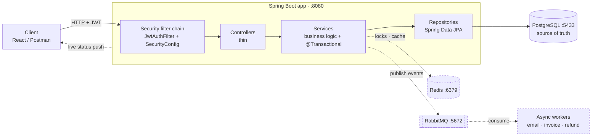

# RentFlow — Backend

An equipment-rental marketplace backend. Java · Spring Boot · PostgreSQL.

> **The product in one line:** a rental marketplace that never double-books an item under
> concurrent requests, and never loses or double-charges money when payments fail or webhooks
> arrive twice.

| | |
|---|---|
| **Runs at** | `http://localhost:8080` |
| **Status** | Week 1 complete — auth + item CRUD are live. Booking, payments, analytics are next. |
| **API reference** | [docs/API_DOCS.md](docs/API_DOCS.md) |
| **Request flow diagrams** | [docs/API_FLOW.md](docs/API_FLOW.md) |
| **Full product/system design** | [docs/README.md](docs/README.md) |

---

## Table of Contents
1. [What this product is](#1-what-this-product-is)
2. [What we are trying to achieve](#2-what-we-are-trying-to-achieve)
3. [What works today](#3-what-works-today)
4. [Run it on localhost](#4-run-it-on-localhost)
5. [Verify the install](#5-verify-the-install)
6. [The stack — what, why, justified](#6-the-stack--what-why-justified)
7. [Architecture](#7-architecture)
8. [Project layout](#8-project-layout)
9. [Command cheat sheet](#9-command-cheat-sheet)
10. [Troubleshooting](#10-troubleshooting)
11. [Documentation index](#11-documentation-index)

---

## 1. What this product is

RentFlow is a **peer-to-peer marketplace for renting physical equipment** — cameras, drones, power
tools, camping gear.

A user lists an item with a **daily rate** and a **refundable security deposit**. Another user books
it for a date range, pays rent + deposit up front, collects the item, returns it, and gets the
deposit back — in full, or partially if the item comes back damaged.

**One account type does everything.** Like YouTube — every account *can* upload, most just watch —
every RentFlow user can both list and rent. Whether you may edit a given item is decided by
**ownership of that row**, not by a separate "owner" role. A single **ADMIN** oversees the platform.

The three actors:

| Actor | Does |
|-------|------|
| **Owner** (any user) | Lists an item, sets rate + deposit, approves returns, receives payout |
| **Renter** (any user) | Browses, books a date range, pays, returns, gets deposit back |
| **Admin** | Platform oversight and analytics |

---

## 2. What we are trying to achieve

This is a portfolio project built to demonstrate **senior backend engineering**, so the domain was
chosen deliberately: rentals force you to solve two genuinely hard problems that most CRUD projects
never touch.

### Problem 1 — Concurrency: never double-book
Two people click "Book" on the same camera for the same weekend at the same millisecond. A naive
`if (available) { book() }` check-then-act **will** sell the same dates twice, because both requests
read "available" before either writes.

**Solution:** a Redis distributed lock per item, plus a Postgres exclusion constraint on the date
range as the last line of defence, plus optimistic locking (`@Version`) on the row. The database is
made *incapable* of storing overlapping bookings — application logic is the fast path, the constraint
is the guarantee.

### Problem 2 — Payment correctness: never lose or double-charge money
Payment gateways fail mid-flight, time out after actually succeeding, and deliver the same webhook
three times. Money must survive all of it.

**Solution:** every money movement is an **append-only ledger entry** (nothing is ever mutated),
every gateway call carries an **idempotency key**, webhooks are deduplicated by event id, and a
reconciliation job compares our ledger against the gateway's records on a schedule.

### Why these two
They are exactly what senior backend interviews probe: *"how do you prevent a race condition across
instances?"* and *"how do you keep money correct when the network lies to you?"* Everything else in
this project — auth, CRUD, async, realtime — is scaffolding that lets those two problems exist.

### Non-goals
Not building: chat, reviews/ratings, search relevance ranking, mobile apps, multi-currency,
or a real payment processor integration in production mode. See [docs/README.md](docs/README.md)
§14 for what was considered and deliberately scoped out.

---

## 3. What works today

✅ **Live**

| Feature | Endpoints |
|---------|-----------|
| Health & version | `GET /actuator/health`, `/actuator/info`, `/api/version` |
| Registration | `POST /auth/register` — BCrypt hashing, duplicate-email guard |
| Login | `POST /auth/login` — returns a 24 h JWT |
| Browse items | `GET /items`, `GET /items/{id}` — public |
| List an item | `POST /items` — authenticated, owner taken from the token |
| Edit an item | `PUT /items/{id}` — authenticated **and** owner-only |
| Uniform errors | one `ApiError` JSON shape for 400/401/403/404/409 |
| Schema migrations | Flyway `V1__users.sql`, `V2__items.sql` |

⏳ **Not built yet** — booking engine, payments + ledger, refunds/settlement, async notifications,
WebSocket live status, GraphQL admin analytics. Roadmap in [docs/PLAN.md](docs/PLAN.md).

---

## 4. Run it on localhost

### 4.1 Prerequisites

| Tool | Why | Check |
|------|-----|-------|
| **JDK 17+** | compiles and runs the app | `java -version` |
| **Docker Desktop** | runs Postgres, Redis, RabbitMQ, pgAdmin | `docker --version` |
| Maven | **not needed** — the repo ships the `mvnw` wrapper | — |

### 4.2 Clone and enter

```bash
git clone <repo-url> rentFlowBackend
cd rentFlowBackend
```

### 4.3 Create your `.env` (optional in dev)

`application.yml` already defaults to working dev values, so the app runs without a `.env`. Create
one when you want to override anything:

```bash
cp .env.example .env
```

```bash
DB_URL=jdbc:postgresql://localhost:5433/rentflow    # host port 5433, not 5432 — see note below
DB_USER=rentflow
DB_PASSWORD=rentflow
REDIS_HOST=localhost
RABBIT_HOST=localhost
JWT_SECRET=change-me-to-a-long-random-string-at-least-32-chars
```

> **Why port 5433?** The Docker Postgres is mapped `5433:5432` so it doesn't collide with a native
> PostgreSQL already using 5432 on the dev machine. Inside Docker it's still 5432.

> `.env` is git-ignored. `JWT_SECRET` must be **at least 32 characters** — HMAC-SHA256 needs a
> 256-bit key and the app will refuse to start otherwise.

### 4.4 Start the infrastructure

```bash
docker compose up -d
```

Brings up four containers:

| Container | Port | What it is |
|-----------|------|------------|
| `rentflow-postgres` | `5433` | the database |
| `rentflow-redis` | `6379` | distributed locks / cache |
| `rentflow-rabbitmq` | `5672`, UI `15672` | async message broker (`guest`/`guest`) |
| `rentflow-pgadmin` | `5050` | web GUI for Postgres — no login, server pre-registered |

Wait for Postgres to be healthy: `docker compose ps` should show `healthy`.

### 4.5 Run the app

```bash
# macOS / Linux / Git Bash
./mvnw spring-boot:run

# Windows PowerShell
.\mvnw.cmd spring-boot:run
```

On startup Flyway applies `V1__users.sql` and `V2__items.sql` automatically, then Hibernate
validates the entities against the real schema. Server is up when you see
`Tomcat started on port 8080`.

---

## 5. Verify the install

```bash
# 1. Is it alive? Expect "status":"UP" with db/redis/rabbit all UP
curl http://localhost:8080/actuator/health

# 2. Our own controller layer
curl http://localhost:8080/api/version

# 3. Register
curl -X POST http://localhost:8080/auth/register \
  -H "Content-Type: application/json" \
  -d '{"name":"Rajat","email":"rajat@example.com","password":"supersecret123"}'

# 4. Log in and keep the token
curl -X POST http://localhost:8080/auth/login \
  -H "Content-Type: application/json" \
  -d '{"email":"rajat@example.com","password":"supersecret123"}'

# 5. Create a listing with that token
curl -X POST http://localhost:8080/items \
  -H "Content-Type: application/json" \
  -H "Authorization: Bearer <paste accessToken>" \
  -d '{"title":"Sony A7 III","description":"2 batteries","dailyRate":1500.00,"depositAmount":20000.00}'

# 6. Browse — no auth needed
curl http://localhost:8080/items
```

On PowerShell use `curl.exe` (plain `curl` is an alias for `Invoke-WebRequest` and won't accept
these flags).

Full endpoint reference with every field and error case: [docs/API_DOCS.md](docs/API_DOCS.md).

Inspect the database at **http://localhost:5050** (pgAdmin, no login — the RentFlow server is
pre-registered; enter password `rentflow` on first connect).

---

## 6. The stack — what, why, justified

Every technology here is present because the product **needs** it. If an interviewer asks
"why is this here?", these are the answers.

### Core

| Tech | Used for | Why this and not the alternative |
|------|----------|----------------------------------|
| **Java 17 + Spring Boot 4** | the whole application | Mature ecosystem for transactional, money-handling systems. `@Transactional` gives declarative transaction boundaries — the single most important tool when correctness of money matters. |
| **Spring Web MVC** | REST controllers | Blocking/servlet model, which pairs naturally with JPA. WebFlux was rejected: it needs reactive DB drivers (R2DBC) and would fight JPA for no benefit at our concurrency level. |
| **Maven + `mvnw` wrapper** | build & dependencies | Wrapper means nobody needs Maven installed and everyone builds with the identical version. |
| **PostgreSQL 16** | source of truth | Chosen specifically for two features we depend on: **exclusion constraints with `tstzrange`** (the database itself refuses overlapping bookings) and true ACID transactions. MongoDB cannot express that constraint — the double-booking guarantee would have to live in application code, which is exactly the thing we don't trust. |
| **Spring Data JPA + Hibernate** | persistence | Removes boilerplate SQL; derived queries (`findByEmail` → `WHERE email = ?`). Also gives `@Version` **optimistic locking**, which is our defence against lost updates on concurrent edits. Raw SQL stays available for the few hot paths that need it. |
| **Flyway** | schema migrations | Schema is versioned, ordered, and applied identically on every machine and every environment. Hibernate runs `ddl-auto: validate` — Flyway owns the schema, Hibernate only checks it matches. Auto-generated DDL is never trustworthy in production. |

### Security

| Tech | Used for | Why |
|------|----------|-----|
| **Spring Security** | the filter chain, route rules | One declarative table of who can call what, instead of guards scattered per route. |
| **JWT (`jjwt` 0.12)** | stateless auth | The token carries `uid`/`email`/`role` signed with HMAC-SHA256, so any instance can authenticate a request **without a session store or DB lookup** — a prerequisite for running more than one instance. Cost: no instant revocation; a token is valid until it expires (24 h). Accepted trade-off at this stage. |
| **BCrypt** | password hashing | Per-password salt plus a deliberately slow work factor, so a leaked table can't be brute-forced cheaply. Never store or log the raw password — the DB only ever sees the hash. |
| **`OwnershipGuard`** | resource-level authorization | Roles answer *what kind of user*; ownership answers *whose row*. Every write path needs both. Centralising the check means one place to change the rule and one place to test it. |
| **Bean Validation (`@Valid`)** | input validation | Constraints declared on the DTO record, enforced before any business logic runs, and translated into a uniform 400 with a `field → message` map. |

### Infrastructure (installed and running, wired in upcoming weeks)

| Tech | Used for | Why it's non-negotiable for this product |
|------|----------|------------------------------------------|
| **Redis** | distributed lock on booking; caching; pub/sub fan-out | A JVM `synchronized` block only locks **one instance**. The moment you run two, it guarantees nothing. Redis gives a lock that all instances respect — the difference between a toy and a system that survives horizontal scaling. |
| **RabbitMQ** | async work: emails, invoices, deposit-refund jobs | Sending an email inside the booking transaction makes the user wait on SMTP and lets a mail failure roll back a valid booking. Publishing an event instead keeps the request fast and makes the side-effect retryable, with a dead-letter queue for what still fails. |
| **WebSocket / STOMP** | live payment-status push | Payment confirmation is asynchronous — it arrives by webhook seconds later. Polling from the browser is wasteful and laggy; a push tells the user "payment confirmed" the instant the webhook lands. |
| **GraphQL** | admin analytics dashboard only | An analytics dashboard asks wildly varying, deeply nested questions ("revenue by category by month, with top owners"). REST would need a new endpoint per widget or return massively over-fetched payloads. GraphQL lets one endpoint serve them all. **Deliberately not used for the transactional API** — REST's explicit contract and cacheability are worth more there. Using the right tool in the right place is the point. |
| **Docker Compose** | local infrastructure | One command brings up four services identically on any machine, instead of four manual installs. |
| **pgAdmin** | DB inspection | Browser GUI for the database during development. Dev-only convenience. |
| **Spring Actuator** | `/actuator/health`, `/info` | Real liveness/readiness reporting per dependency (db, redis, rabbit) — what a load balancer or Kubernetes probe would consume. |

### Deliberate design decisions

| Decision | Reason |
|----------|--------|
| **DTOs at every boundary, never expose entities** | The API contract and the DB schema evolve independently, and a field like `passwordHash` cannot leak by accident. `UserResponse.from()` / `ItemResponse.from()` are the only conversion points. |
| **Thin controller, fat service, dumb repository** | Business rules live in exactly one layer. A controller that knows business rules, or a service that knows HTTP status codes, means the code is in the wrong place. |
| **Package by feature, not by layer** | Everything about items lives in `item/`. A change to items touches one folder instead of three. |
| **`BigDecimal` for all money, `NUMERIC(12,2)` in the DB** | `double`/`float` accumulate binary rounding error. Money is never floating point. |
| **Owner id read from the token, never from the request body** | There is no field an attacker could tamper with to create or edit something as someone else. |
| **Central `@RestControllerAdvice`** | Every error returns the same JSON shape, and controllers stay free of `try/catch`. |
| **Append-only ledger for money** *(upcoming)* | A mutable `balance` column loses history and hides bugs. Append-only entries mean every rupee is traceable and any state is re-derivable. |

---

## 7. Architecture



Dashed = installed and running, wired in upcoming weeks.

Layer contract and per-endpoint request traces: [docs/API_FLOW.md](docs/API_FLOW.md).

---

## 8. Project layout

```
rentFlowBackend/
├── docker-compose.yml          postgres · redis · rabbitmq · pgadmin
├── pom.xml                     dependencies + build
├── mvnw / mvnw.cmd             Maven wrapper (no Maven install needed)
├── .env.example                template — copy to .env
│
├── docs/
│   ├── README.md               full product + system design
│   ├── API_DOCS.md             endpoint reference
│   ├── API_FLOW.md             request-flow diagrams
│   ├── PLAN.md                 5-week build plan
│   ├── SETUP.md                how the project was scaffolded
│   ├── BACKEND.md              backend conventions
│   └── Initial_hld.md / Initial_lld.md
│
└── src/main/
    ├── java/com/rentflow/
    │   ├── RentflowBackendApplication.java     entry point
    │   ├── common/                             VersionController · audit · exceptions
    │   ├── security/                           SecurityConfig · JwtAuthFilter · JwtService
    │   │                                       AuthenticatedUser · OwnershipGuard
    │   ├── user/                               AuthController · UserService · User · dto/
    │   └── item/                               ItemController · ItemService · Item · dto/
    └── resources/
        ├── application.yml                     config: db · redis · rabbit · jwt · actuator
        └── db/migration/                       V1__users.sql · V2__items.sql
```

---

## 9. Command cheat sheet

```bash
docker compose up -d              # start postgres, redis, rabbitmq, pgadmin
docker compose ps                 # check container health
docker compose logs -f postgres   # tail one service
docker compose down               # stop everything (data survives in the volume)
docker compose down -v            # stop AND wipe the database volume

./mvnw spring-boot:run            # run the app (Flyway migrates on startup)
./mvnw test                       # run all tests
./mvnw clean package              # build a runnable jar in target/
```

On PowerShell substitute `.\mvnw.cmd` for `./mvnw`.

Useful URLs:

| URL | What |
|-----|------|
| http://localhost:8080/actuator/health | app + dependency health |
| http://localhost:8080/api/version | app version |
| http://localhost:5050 | pgAdmin — inspect the database |
| http://localhost:15672 | RabbitMQ management UI (`guest`/`guest`) |

---

## 10. Troubleshooting

| Symptom | Cause | Fix |
|---------|-------|-----|
| App exits with a connection refused on startup | Containers aren't up yet | `docker compose ps` — wait for postgres `healthy`, then rerun |
| `Port 5433 already allocated` | Something else holds the port | Change the host side of `5433:5432` in `docker-compose.yml` **and** `DB_URL` |
| Startup fails with a key-length error | `JWT_SECRET` shorter than 32 chars | Use a longer secret — HMAC-SHA256 needs 256 bits |
| `Schema validation: missing table` | Flyway didn't run, or the volume holds an old schema | `docker compose down -v` then `docker compose up -d` to start clean |
| Protected route returns **403**, expected 401 | Missing/expired tokens are rejected in the filter chain, before the exception handler | Expected behaviour today — see [docs/API_DOCS.md](docs/API_DOCS.md) §2 |
| `curl --version` errors in PowerShell | `curl` is an alias for `Invoke-WebRequest` | Use `curl.exe` |
| `mvn: command not found` | Maven isn't installed globally | Use the wrapper: `./mvnw` or `.\mvnw.cmd` |
| Timezone error from PostgreSQL | Windows reports the deprecated `Asia/Calcutta` alias | Already handled — `pom.xml` forces `-Duser.timezone=Asia/Kolkata` |

---

## 11. Documentation index

| Doc | Read it for |
|-----|-------------|
| [docs/README.md](docs/README.md) | Full product spec, HLD, data model, concurrency and payment design |
| [docs/API_DOCS.md](docs/API_DOCS.md) | Every endpoint: request/response shapes, validation, status codes |
| [docs/API_FLOW.md](docs/API_FLOW.md) | Mermaid diagrams of how a request travels through the code |
| [docs/PLAN.md](docs/PLAN.md) | Day-by-day 5-week build plan with progress |
| [docs/SETUP.md](docs/SETUP.md) | How the project was scaffolded from scratch, and why each choice |
| [docs/BACKEND.md](docs/BACKEND.md) | Backend conventions and package structure |
| [docs/Initial_hld.md](docs/Initial_hld.md) · [docs/Initial_lld.md](docs/Initial_lld.md) | Original high- and low-level design notes |
