# RentFlow Backend — API Flow (API_FLOW.md)

Diagrams only. Shapes, status codes and validation rules live in [API_DOCS.md](docs/API_DOCS.md).

> Rendered by GitHub natively. In VS Code install the **Markdown Preview Mermaid Support** extension.

---

## 1. The full pipeline

Every request travels this path.

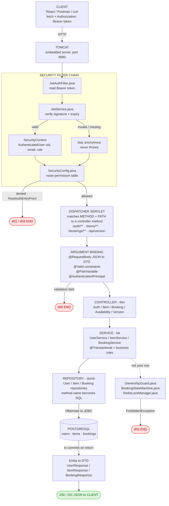

---

## 2. File-to-file chain

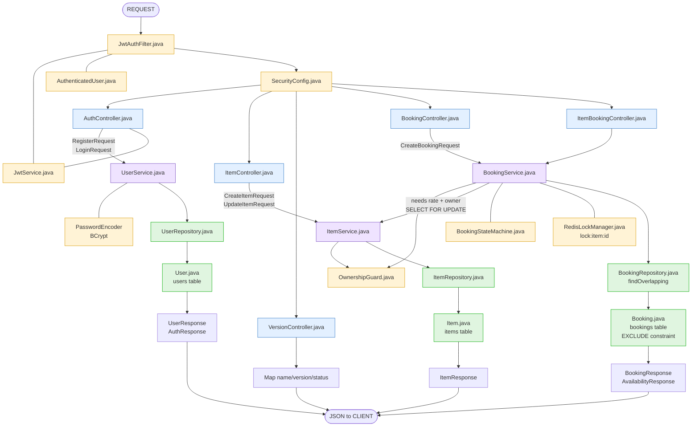

Note the dependency direction: `BookingService` uses `ItemService`, never the reverse. That's why
the availability endpoint lives in the booking package even though its URL starts with `/items` —
putting it in `ItemController` would create a cycle.

---

## 3. POST /auth/register

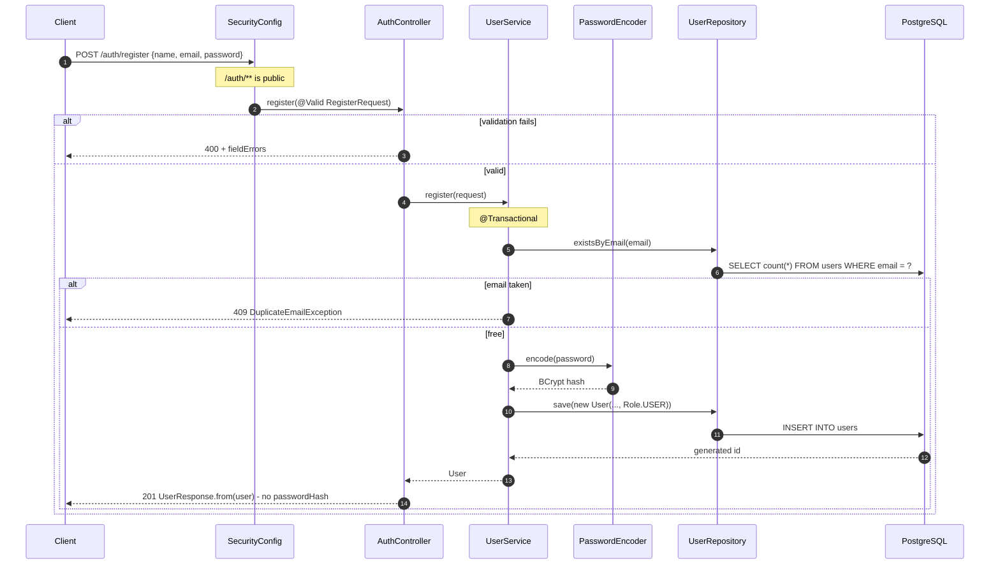

---

## 4. POST /auth/login

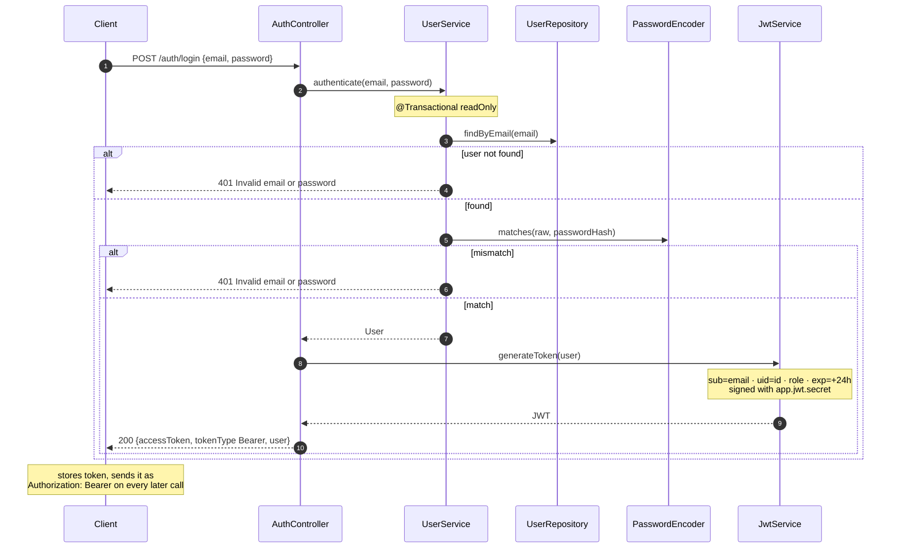

---

## 5. GET /items and GET /items/{id} — public

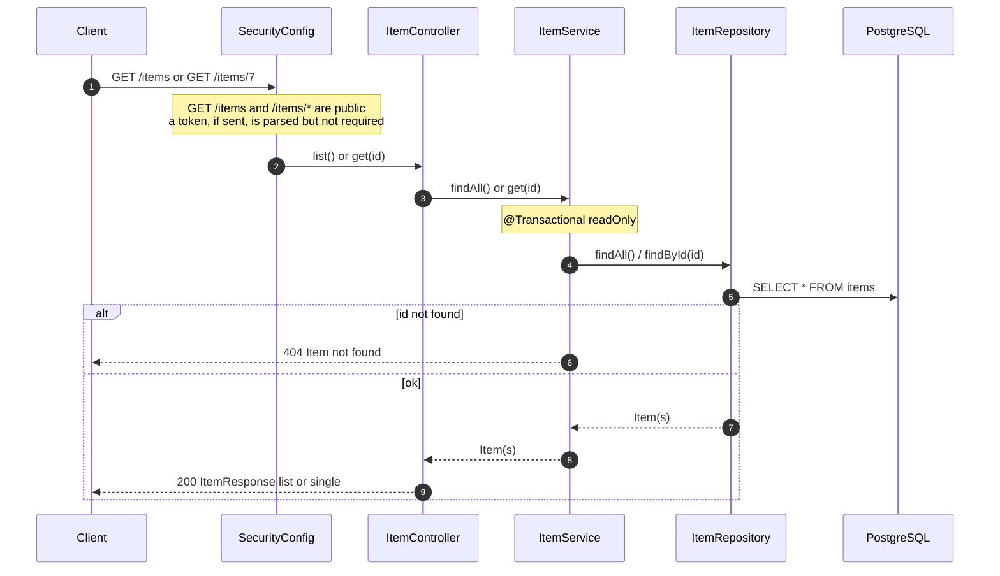

---

## 6. POST /items and PUT /items/{id} — protected

Two gates: **authentication** in the filter chain, then **ownership** in the service.

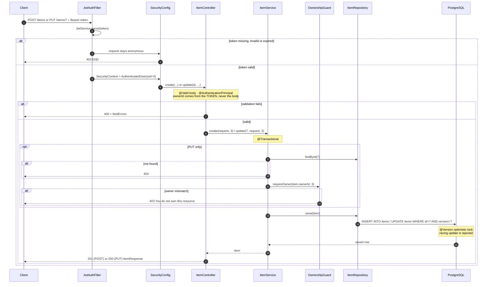

---

## 6b. GET /items/{id}/availability — public

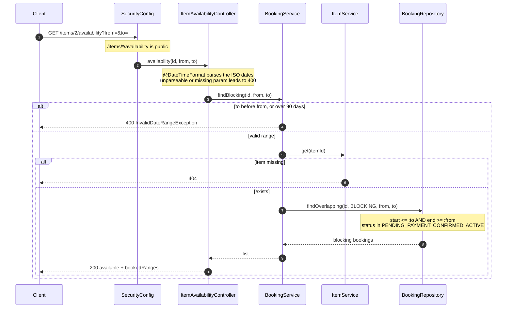

---

## 6c. POST /bookings — the concurrency path

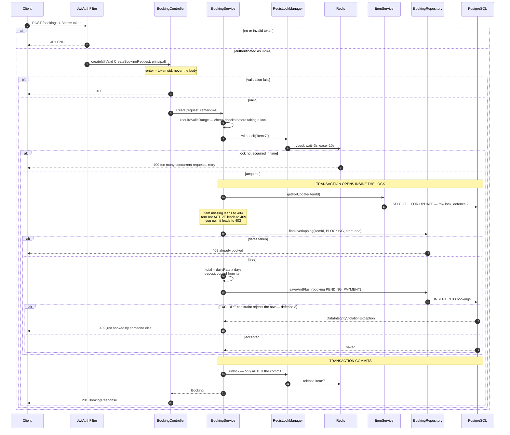

**The ordering is the whole point.** The lock is taken *outside* the transaction and released
*after* it commits. `BookingService.create` uses a `TransactionTemplate` instead of
`@Transactional` precisely so this nesting is visible in the code rather than hidden in an
annotation. Get it backwards — lock inside the transaction — and the lock is released while the
commit is still in flight, letting the next writer read stale data and book the same dates.

**Why `saveAndFlush` and not `save`:** `save` only queues the INSERT, so the constraint would fire
at commit time — outside the method, where the exception can no longer be translated into a clean
409. Flushing forces the database to check *here*.

---

## 6d. Booking state machine

Legal transitions live in one table in
[BookingStateMachine.java](src/main/java/com/rentflow/booking/BookingStateMachine.java).
Anything not drawn below is rejected with a 409.

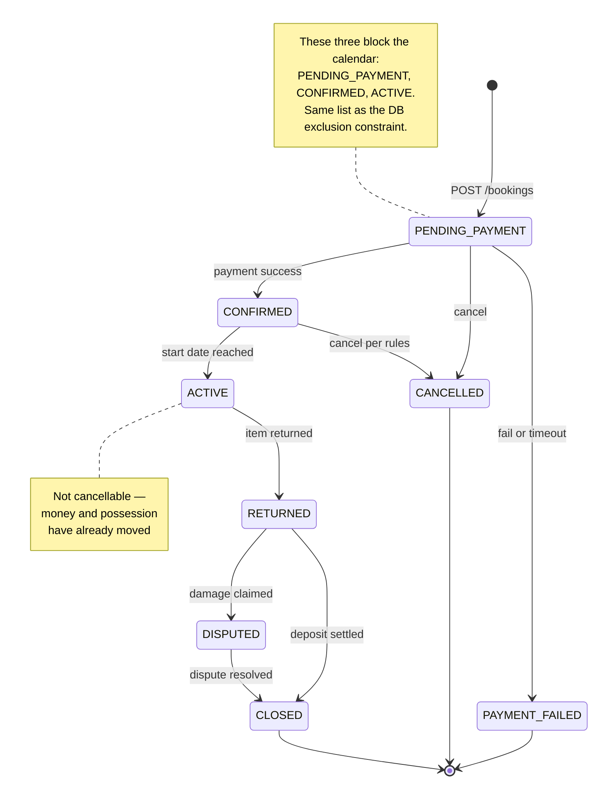

Two transitions are wired to endpoints today: **create** (`POST /bookings` → `PENDING_PAYMENT`)
and **cancel** (`POST /bookings/{id}/cancel` → `CANCELLED`). The rest are defined and tested but
unreachable until payments (Week 3) and the return flow exist.

---

## 6f. POST /bookings/{id}/cancel

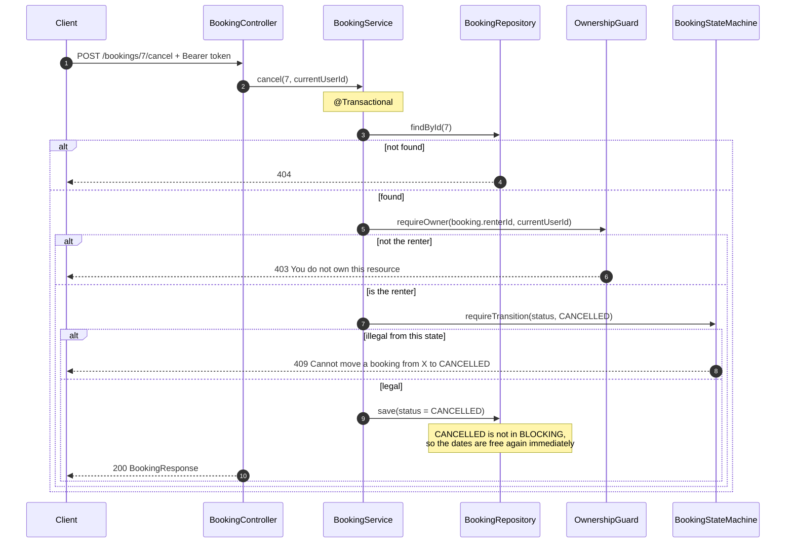

---

## 6e. The three defences against double-booking

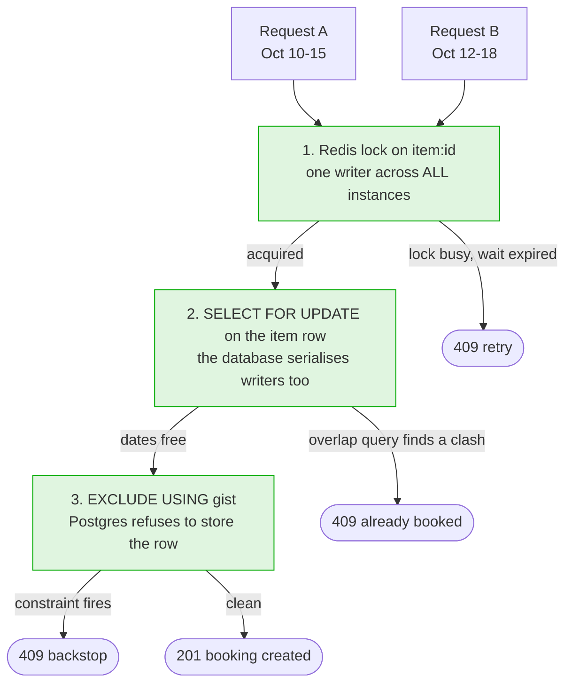

All three are live. Each alone has a hole — 1 fails if Redis is down, 2 fails if someone forgets
the transaction, 3 gives a correct but unfriendly error. Together they leave none.

Measured, not assumed —
[BookingConcurrencyIT](src/test/java/com/rentflow/booking/BookingConcurrencyIT.java) fires 500
simultaneous requests at one slot:

```
 requests fired      : 500
 succeeded           : 1
 rejected (conflict) : 499
 unexpected errors   : 0
 bookings in database: 1
```

A second test repeats it with layer 1 bypassed entirely and still gets exactly one booking. A third
proves the locking doesn't reject legitimate non-overlapping bookings.

---

## 7. Error path

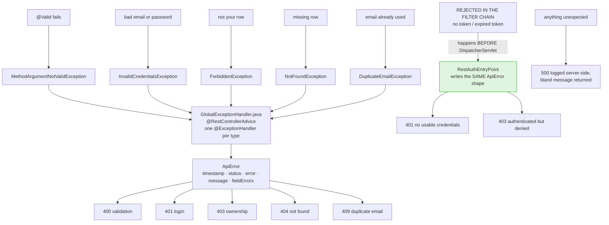

Every error the API returns has the identical `ApiError` shape, whether it came from a controller,
a service, or the security filter chain.

---

## 8. Startup — before any request

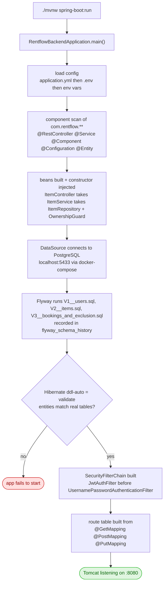

---

## 9. Layer contract

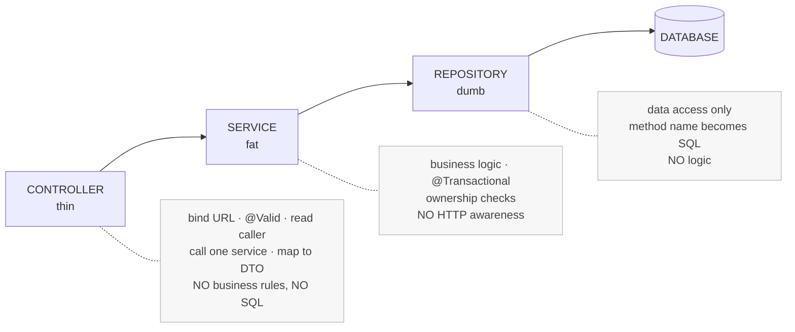
