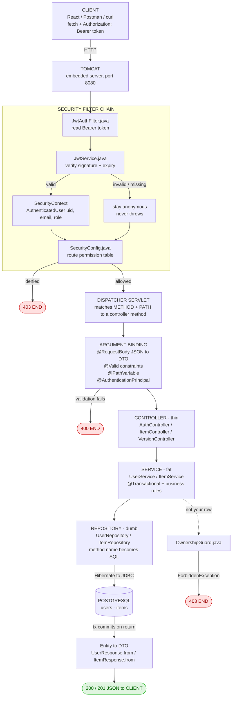
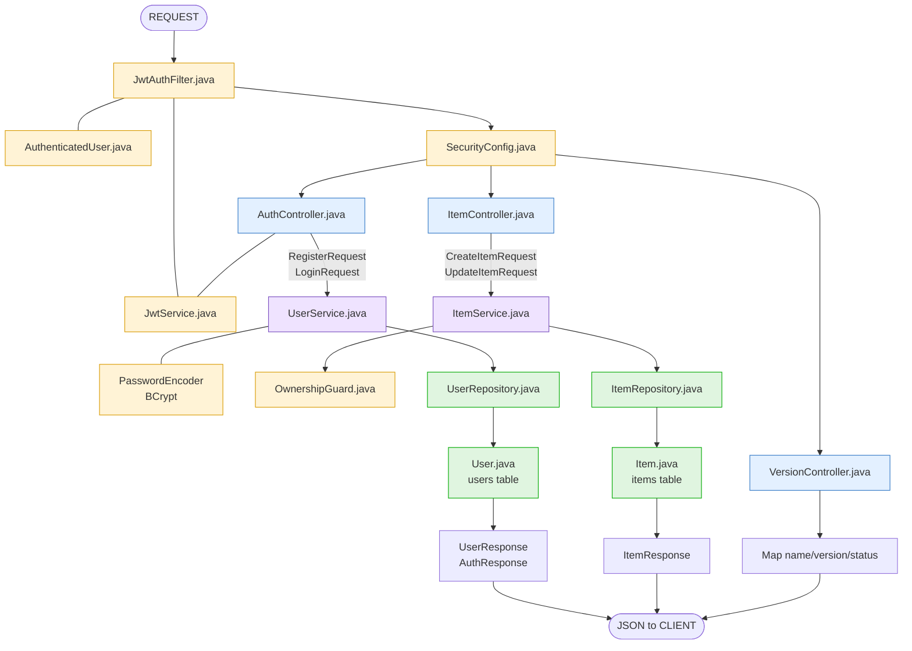
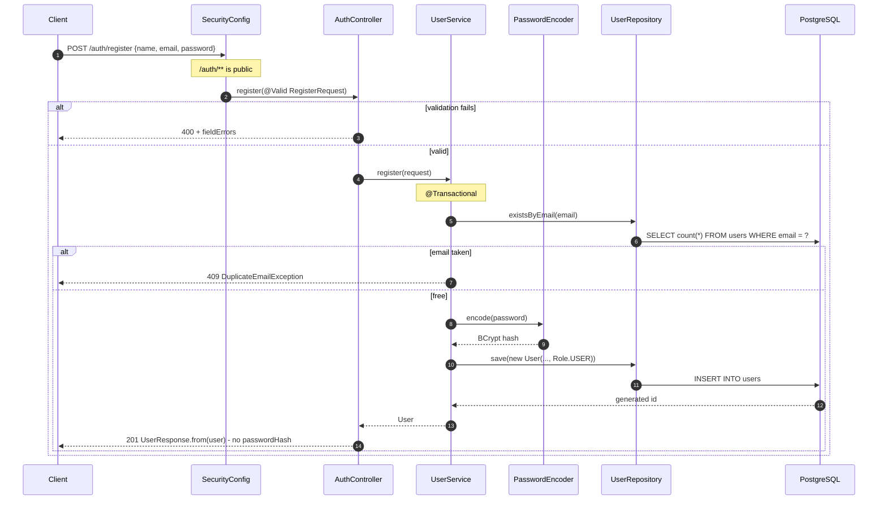
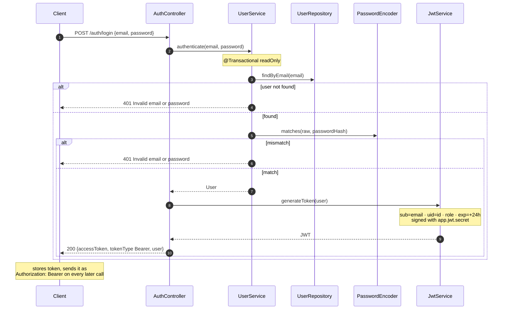
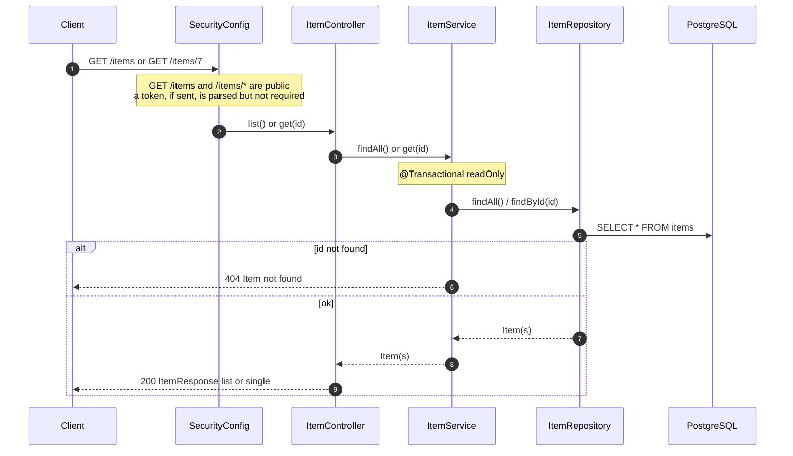
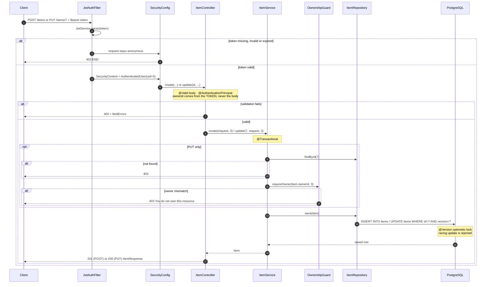
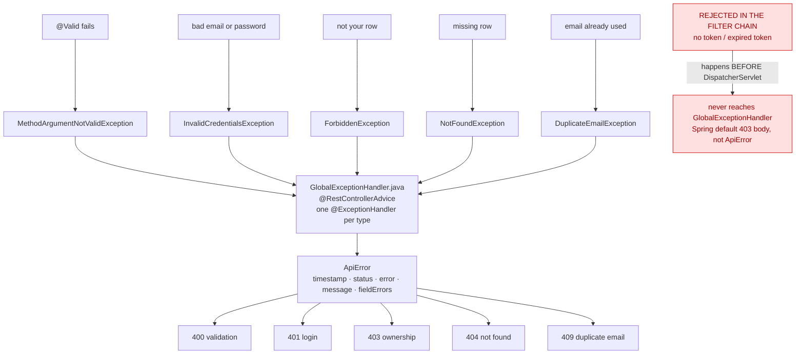
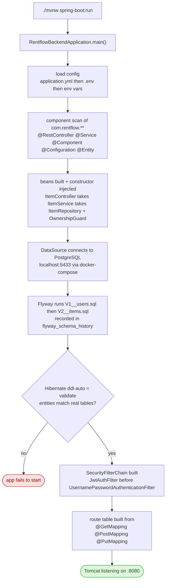
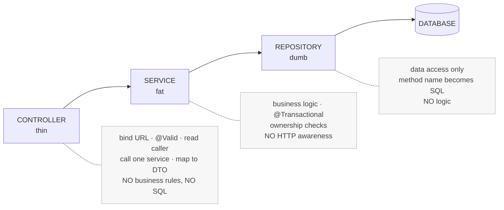

# RentFlow Backend — API Flow (API_FLOW.md)

Diagrams only. Shapes, status codes and validation rules live in [API_DOCS.md](docs/API_DOCS.md).

> Rendered by GitHub natively. In VS Code install the **Markdown Preview Mermaid Support** extension.

---

## 1. The full pipeline

Every request travels this path.

---

## 2. File-to-file chain

---

## 3. POST /auth/register

---

## 4. POST /auth/login

---

## 5. GET /items and GET /items/{id} — public

---

## 6. POST /items and PUT /items/{id} — protected

Two gates: **authentication** in the filter chain, then **ownership** in the service.

---

## 7. Error path

---

## 8. Startup — before any request

---

## 9. Layer contract

