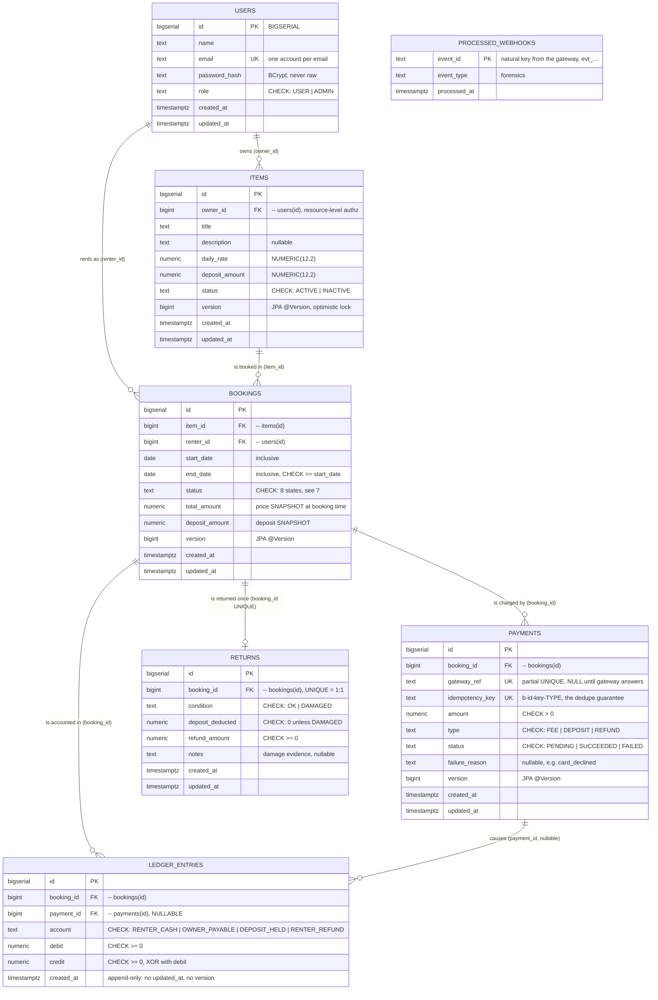
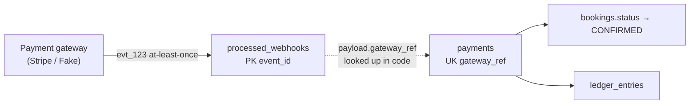
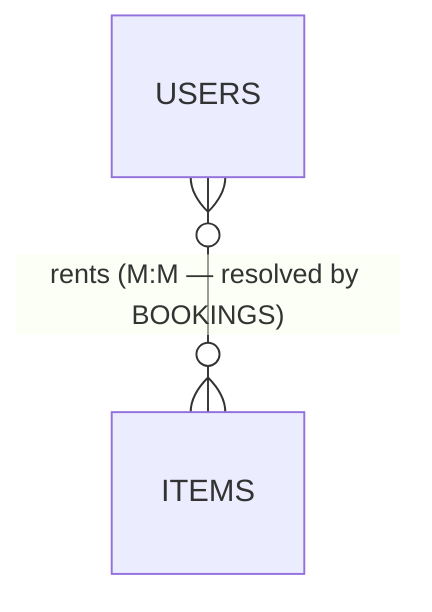
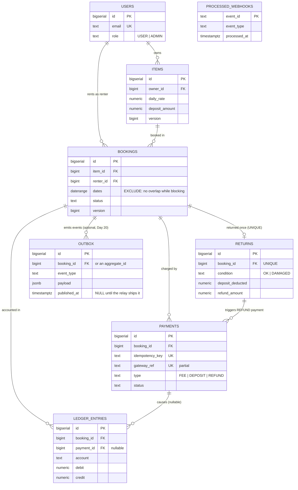

# RentFlow — Entity Relationship Diagram (ER_Diagram.md)

Every table, every key, every relationship — as the code has it **today**, and as the
5-week plan (`PLAN.md`) will leave it. Diagrams are Mermaid `erDiagram`, so GitHub, VS Code
(Markdown Preview Mermaid), and most doc viewers render them inline.

**Legend used throughout**

| Marker | Meaning |
|---|---|
| `PK` | primary key |
| `FK` | foreign key (a real `REFERENCES` constraint in Postgres) |
| `UK` | unique key / unique index |
| `1 : M` | one-to-many |
| `1 : 1` | one-to-one (enforced by a `UNIQUE` on the FK column) |
| `M : M` | many-to-many (never a raw join table here — see §6) |

Mermaid crow's-foot notation in the diagrams below:
`||` exactly one · `o{` zero-or-many · `|{` one-or-many · `o|` zero-or-one.

---

## 1. The models at a glance

| # | Table | JPA entity | Migration | Status |
|---|---|---|---|---|
| 1 | `users` | [User.java](../src/main/java/com/rentflow/user/User.java) | `V1__users.sql` | ✅ built |
| 2 | `items` | [Item.java](../src/main/java/com/rentflow/item/Item.java) | `V2__items.sql` | ✅ built |
| 3 | `bookings` | [Booking.java](../src/main/java/com/rentflow/booking/Booking.java) | `V3__bookings_and_exclusion.sql` | ✅ built |
| 4 | `payments` | [Payment.java](../src/main/java/com/rentflow/payment/Payment.java) | `V4__payments_ledger.sql` | ✅ built |
| 5 | `ledger_entries` | [LedgerEntry.java](../src/main/java/com/rentflow/ledger/LedgerEntry.java) | `V4__payments_ledger.sql` | ✅ built |
| 6 | `processed_webhooks` | [ProcessedWebhook.java](../src/main/java/com/rentflow/payment/ProcessedWebhook.java) | `V5__returns_webhooks.sql` | ✅ built |
| 7 | `returns` | *(none yet — Day 18)* | `V5__returns_webhooks.sql` | 🚧 table exists, entity pending |
| 8 | `outbox` | *(none)* | *(no migration)* | ⏳ optional, Day 20 |

**6 entities, 7 tables live in the database today.** The `returns` table was deliberately
migrated early so Day 18's settlement service lands on an existing schema. `outbox` is the
only genuinely-not-yet-existing table, and it is marked optional in the plan.

---

## 2. Current ER diagram (what is in the code today)



> `PROCESSED_WEBHOOKS` is drawn with **no relationship line on purpose** — see §5.

---

## 3. Relationship catalogue

| # | Relationship | Cardinality | FK column (child side) | Optionality | Why it is modelled this way |
|---|---|---|---|---|---|
| R1 | `User` → `Item` | **1 : M** | `items.owner_id` → `users.id` | `NOT NULL` — an item must have an owner | Ownership lives in a **column**, not in a role. Authorisation is per-resource (`item.ownerId == currentUser.id`), which is why there is no `OWNER` role. |
| R2 | `User` → `Booking` | **1 : M** | `bookings.renter_id` → `users.id` | `NOT NULL` | A user, acting as renter, has many bookings. "Owner" and "renter" are *capabilities of the same user*, not separate tables. |
| R3 | `Item` → `Booking` | **1 : M** | `bookings.item_id` → `items.id` | `NOT NULL` | One item is booked many times across different date ranges. Booking history and the overlap check both live here. |
| R4 | `Booking` → `Payment` | **1 : M** | `payments.booking_id` → `bookings.id` | `NOT NULL` | One booking produces several money movements: a `FEE` row, a `DEPOSIT` row, later a `REFUND` row. Each is its own attempt with its own status. |
| R5 | `Booking` → `LedgerEntry` | **1 : M** | `ledger_entries.booking_id` → `bookings.id` | `NOT NULL` | Double-entry: every movement writes **≥ 2** balanced rows. The classic worked example is ₹2000 fee + ₹5000 deposit → **4 rows**, 7000 debit = 7000 credit. |
| R6 | `Payment` → `LedgerEntry` | **1 : M (optional parent)** | `ledger_entries.payment_id` → `payments.id` | **NULLABLE** | Nullable on purpose: settlement entries at return time (deposit released, damage claimed) move money *between accounts* with no gateway payment behind them. |
| R7 | `Booking` → `Return` | **1 : 1** | `returns.booking_id` → `bookings.id`, **UNIQUE** | zero-or-one | An item comes back exactly once. The `UNIQUE` is what stops a retried "confirm return" from releasing the deposit twice — the database refuses, not a service someone might forget to call. |
| R8 | `User` ↔ `Item` | **M : M** | *(none — resolved)* | — | See §6. `Booking` **is** the associative entity. |
| R9 | `ProcessedWebhook` → anything | **none** | *(deliberately no FK)* | — | See §5. |

### Reading the crow's feet
- `USERS ||--o{ ITEMS` — one user, **zero or more** items. A freshly registered user owns nothing; that is valid.
- `BOOKINGS ||--o| RETURNS` — one booking, **zero or one** return. A cancelled booking never gets one.
- `PAYMENTS ||--o{ LEDGER_ENTRIES` — a `FAILED` payment produces **zero** ledger rows. The ledger records what *happened*, not what was attempted.

---

## 4. An important implementation detail: FKs are in the DB, not in the entities

Every FK above is a real `REFERENCES` constraint in Postgres. But **no JPA entity uses
`@ManyToOne` / `@OneToMany`** — they store the plain scalar:

```java
// Booking.java — not @ManyToOne Item item
@Column(name = "item_id", nullable = false)
private Long itemId;
```

| Consequence | Effect |
|---|---|
| Aggregate boundaries stay explicit | `Booking` cannot lazily drag an `Item` and a `User` graph into memory. |
| No N+1 by accident | There is no association to lazily traverse in a loop. |
| No cascade surprises | Deleting is never implicit; referential integrity is the database's job. |
| Locking is deliberate | `findByIdForUpdate` (`SELECT … FOR UPDATE`) is called explicitly where a row must be pinned. |

**So: relational integrity is enforced by Postgres; the object model stays flat.** The ER
diagram is true of the schema — read it as the source of truth over the Java classes.

---

## 5. Why `processed_webhooks` connects to nothing

It is a **standalone dedupe ledger**, keyed on the gateway's own `event_id` (a `TEXT`
**natural primary key**, not a surrogate `BIGSERIAL` — the uniqueness *is* the feature).

The handler runs `INSERT … ON CONFLICT DO NOTHING` **before** it does any work. Two
simultaneous copies of one event serialise on that primary key; the loser inserts zero rows
and returns. A check-then-insert would be the exact race the booking engine exists to avoid.

It has no FK to `payments` because:
1. The event may arrive for a payment we have never heard of (→ 404, stop redelivery).
2. It must survive independently of any row it happens to be about.

The *logical* link is `webhook payload → payment.gateway_ref → payments.id` — resolved in
code at handling time, not by a constraint:



---

## 6. The hidden many-to-many

A **User** rents many **Items**; an **Item** is rented by many **Users**. That is a genuine
`M : M` — and there is **no `user_item` join table**.



`Booking` **is** the associative entity that resolves it, and it carries attributes a plain
join table could not: `start_date`, `end_date`, `status`, `total_amount`, `deposit_amount`,
`version`.

> **The rule:** when a many-to-many needs its own attributes, you promote the join into a
> first-class entity. If item tagging is ever added, `Item }o--o{ Category` via
> `item_category` would be the "pure" join table by contrast — no attributes of its own.

A second M:M hides in the same place: a User relates to a User (owner ↔ renter) only
*through* a Booking. There is no `users.owner_of` anything.

---

## 7. Enumerations (the `CHECK`-constrained columns)

These are string columns in Postgres with a `CHECK`, mirrored by a Java `enum`. Keeping the
two in sync is asserted by a test for `LedgerAccount`.

| Column | Java enum | Values | Note |
|---|---|---|---|
| `users.role` | `Role` | `USER`, `ADMIN` | Owner/renter are not roles. |
| `items.status` | *(plain String)* | `ACTIVE`, `INACTIVE` | Only `ACTIVE` items are bookable. |
| `bookings.status` | `BookingStatus` | `PENDING_PAYMENT`, `CONFIRMED`, `ACTIVE`, `RETURNED`, `CLOSED`, `DISPUTED`, `PAYMENT_FAILED`, `CANCELLED` | The first three are `BLOCKING` — see §8. |
| `payments.type` | `PaymentType` | `FEE`, `DEPOSIT`, `REFUND` | Part of the idempotency key, so one client key can make a fee row *and* a deposit row. |
| `payments.status` | `PaymentStatus` | `PENDING`, `SUCCEEDED`, `FAILED` | A timeout never writes `FAILED` — "no answer" ≠ "declined". |
| `ledger_entries.account` | `LedgerAccount` | `RENTER_CASH`, `OWNER_PAYABLE`, `DEPOSIT_HELD`, `RENTER_REFUND` | Only `OWNER_PAYABLE` is ours to pay out. |
| `returns.condition` | *(entity pending)* | `OK`, `DAMAGED` | `deposit_deducted > 0` requires `DAMAGED`. |

---

## 8. Constraints that are relationships in disguise

Not every rule is an FK. These are the schema-level guarantees worth reading alongside the diagram.

| Constraint | Table | What it enforces |
|---|---|---|
| `no_overlapping_active_bookings` | `bookings` | **The product's core guarantee.** `EXCLUDE USING gist (item_id WITH =, daterange(start_date, end_date, '[]') WITH &&) WHERE status IN ('PENDING_PAYMENT','CONFIRMED','ACTIVE')` — the *database* refuses overlapping active bookings for one item, even if every line of application code is wrong. **Partial**, so a `CANCELLED` / `PAYMENT_FAILED` booking frees its dates again. Needs the `btree_gist` extension to mix an equality column with a range column. |
| `booking_dates_ordered` | `bookings` | `end_date >= start_date`. |
| `ledger_entry_is_one_sided` | `ledger_entries` | `(debit = 0) <> (credit = 0)` — XOR. A line is a debit **or** a credit, never both, never neither. Kills the zero-zero row that balances and means nothing. |
| `return_deduction_needs_damage` | `returns` | `deposit_deducted = 0 OR condition = 'DAMAGED'` — "owner claims damage on an OK return" is structurally impossible. |
| `payments.idempotency_key UNIQUE` | `payments` | A retried `POST /bookings/{id}/pay` collides here instead of creating a second charge. |
| `idx_payment_gateway_ref` | `payments` | **Partial** unique index `WHERE gateway_ref IS NOT NULL` — one gateway intent maps to at most one row, but many pre-gateway NULLs are not a collision. |
| `returns.booking_id UNIQUE` | `returns` | Turns the FK into a **1:1**. |
| `version` columns | `items`, `bookings`, `payments` | JPA `@Version` optimistic locking. Note `ledger_entries` has **none** — append-only rows have nothing to contend on. |

### Supporting indexes

| Index | Table | Serves |
|---|---|---|
| `idx_items_owner` | `items` | "my listings" |
| `idx_booking_availability (item_id, start_date, end_date)` | `bookings` | the overlap query |
| `idx_booking_renter` | `bookings` | `GET /bookings/me` |
| `idx_payment_booking` | `payments` | `GET /bookings/{id}/payments` |
| `idx_payment_pending` *(partial)* | `payments` | the reconciliation worker sweeping stuck `PENDING` rows |
| `idx_ledger_booking` | `ledger_entries` | `SELECT sum(debit), sum(credit) … WHERE booking_id = ?` |
| `idx_processed_webhook_time` | `processed_webhooks` | pruning rows past the gateway's retry window |

---

## 9. Target ER diagram (the whole 5-week plan)

Adds the `Return` **entity** (Day 18) and the optional `outbox` table (Day 20). No other
table is introduced by Weeks 4–5 — GraphQL analytics (Day 21) is **read-only aggregation**
over these same tables, and the Redis cache (Day 22) stores no durable state.



**R10 — `Return` → `Payment` (1 : M, planned).** Recording a `DAMAGED` return produces a
`REFUND` payment row for the balance owed back to the renter. There is **no `returns` FK on
`payments`** — the link runs through the shared `booking_id`, keeping `payments` owned by
exactly one parent. Drawn above as a logical relationship, not a constraint.

**R11 — `Outbox` (optional).** If Day 20's outbox lands, the event row is written *in the
same transaction* as the booking/payment change, and a relay publishes it. Today that job is
done differently — see §10.

---

## 10. What lives outside the relational model

These are not tables, but they connect entities and belong in the picture.

| Store | Holds | Keyed by | Durable? |
|---|---|---|---|
| **Redis** (Redisson `RLock`) | the distributed booking/payment lock | `item:{id}` | No — TTL leases |
| **Redis** (Day 22) | cached hot `GET /items` | item id | No — invalidated on write |
| **Redis pub/sub** (Day 19) | websocket fan-out across instances | `payments:user:{id}` | No |
| **RabbitMQ** | `payment.succeeded`, `booking.confirmed`, `return.recorded` | routing key | Queue-durable, not a record |

**Domain events carry entity data by value**, so a consumer never calls back into the API
and races the transaction that produced the event:

| Event | Carries | Maps to entities |
|---|---|---|
| `PaymentSucceeded` | `paymentId`, `bookingId`, `paymentType`, `amount` | `payments` → `bookings` |
| `BookingConfirmed` | `bookingId`, `itemId`, `renterId` | `bookings` → `items` → `users` |
| `ReturnRecorded` | `bookingId`, `itemId`, `damaged`, `depositDeducted`, `refundAmount` | `returns` → `bookings` → `items` |

Publication is registered as an **`afterCommit`** synchronisation. Publishing inline would
announce facts that can still roll back — "your booking is confirmed" for a booking the
database never kept. This is the pragmatic stand-in for the outbox in R11.

---

## 11. Walking one booking through the schema

`₹2000 rental fee + ₹5000 deposit`, paid and confirmed:

| Step | Rows written | Table |
|---|---|---|
| Register | 1 user | `users` |
| List item | 1 item, `owner_id` → user | `items` |
| Book | 1 booking `PENDING_PAYMENT`, `item_id` + `renter_id`, prices **snapshot** | `bookings` |
| Pay | 2 payments `PENDING` (`FEE` ₹2000, `DEPOSIT` ₹5000), unique idempotency keys | `payments` |
| Webhook ×2 | 2 dedupe rows | `processed_webhooks` |
| Settle | payments → `SUCCEEDED`, booking → `CONFIRMED` | `payments`, `bookings` |
| Account | **4 entries**: `FEE` → debit `RENTER_CASH` / credit `OWNER_PAYABLE`; `DEPOSIT` → debit `RENTER_CASH` / credit `DEPOSIT_HELD` | `ledger_entries` |
| Return | 1 return row (UNIQUE per booking) + settlement entries | `returns`, `ledger_entries` |

`sum(debit) = 7000 = sum(credit)` for that booking — the two credits sit in **different**
accounts, because only `OWNER_PAYABLE` is ours to pay out.

---

## 12. Related reading

- [Initial_lld.md](Initial_lld.md) — entity responsibilities, class diagram, state machine
- [Initial_hld.md](Initial_hld.md) — services, queues, event flow
- [README.md](README.md) §5 — the original DDL sketch this schema was built from
- [PLAN.md](PLAN.md) — day-by-day build order (`returns` = Day 18, `outbox` = Day 20)
- `src/main/resources/db/migration/` — the authoritative schema; heavily commented
