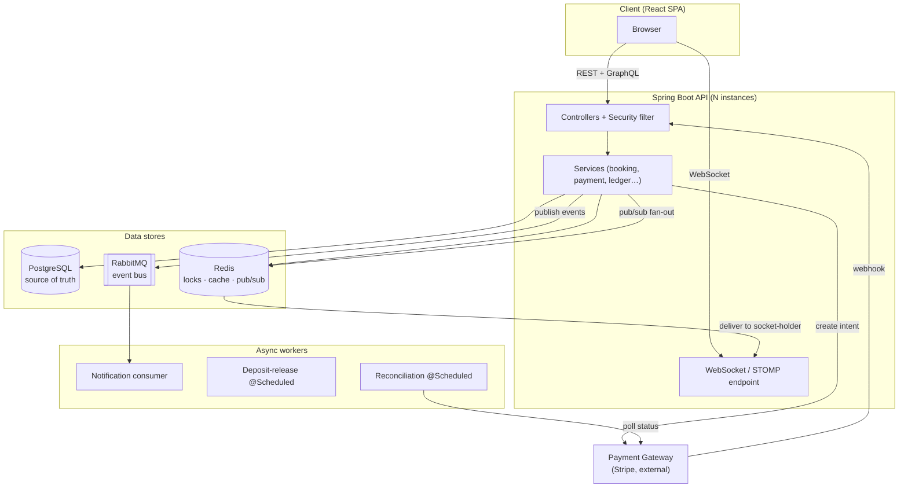
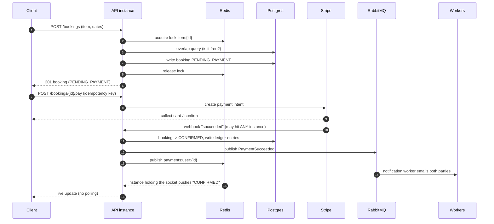
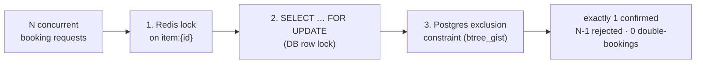
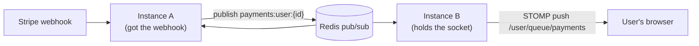
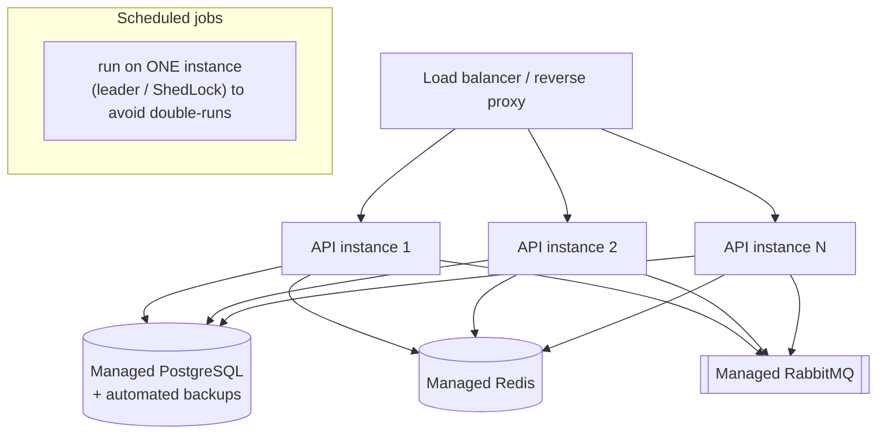

# RentFlow Backend — High-Level Design (HLD)

The **box-and-arrow, runtime view**: what the components are, how a request flows through them, why
each data store is where it is, and **how the whole thing runs in production**. Where the LLD
(`lld.md`) is about *classes*, the HLD is about *components and traffic*.

> Sources: `README.md` (§4 HLD, §8 websockets, §12 async) and `BACKEND.md` (§6 HLD).

---

## 1. System context — the whole picture

---

## 2. The components (one line each)

| Component | Role |
|---|---|
| **Client (React SPA)** | REST for everything, GraphQL for the admin dashboard, one websocket for live payment status |
| **API (Spring Boot)** | controllers + services + security filter; the modular monolith; runs as **N instances** |
| **PostgreSQL** | source of truth: ACID transactions, row locks, the exclusion constraint, the ledger |
| **Redis** | three jobs: distributed **locks**, **cache** for hot listings, **pub/sub** for websocket fan-out |
| **RabbitMQ** | async event bus (`BookingConfirmed`, `PaymentSucceeded`, `ReturnRecorded`) |
| **Payment Gateway (Stripe)** | external; charges cards and sends **webhooks** back |
| **Workers** | notification consumer (email), deposit-release (scheduled), reconciliation (scheduled) |

**Why a modular monolith, not microservices:** the domain is cohesive; one deployable is simpler to
run and reason about. I'd split along a scaling or ownership boundary only once a piece genuinely
diverged — before that, I'd pay distributed-systems tax for no benefit.

---

## 3. The flow that matters — booking + payment (happy path)

**How to narrate this in an interview (one sentence per hop):** "Client hits the API, which grabs a
Redis lock, checks Postgres for an overlap, writes the booking, then calls Stripe. Stripe's webhook
comes back, we write the ledger, and we fire one event that fans out two ways — RabbitMQ for the
email, Redis pub/sub for the live update."

---

## 4. Why each data store is where it is (the defensible choices)

| Store | Job | The one-sentence justification |
|---|---|---|
| **Postgres** | money + bookings | "Bookings and the ledger need ACID and row locking. A document store would fight this." |
| **Redis (locks)** | serialise booking attempts | "An in-process lock breaks the moment I run two API instances. A Redis lock is shared, so it's correct under horizontal scaling." |
| **Redis (cache)** | hot listings | "Reads dominate browsing; cache `GET /items` and invalidate on write." |
| **Redis (pub/sub)** | websocket fan-out | "The webhook can land on any instance, but the user's socket is on one specific instance. Pub/sub fans the event to all instances so the right one delivers it." |
| **RabbitMQ** | async work | "Email and settlement are slow and retryable. They don't belong on the request thread, so they go on a queue with retry and dead-letter semantics." |

**Redis earns its place three times over** — that's why it's in the stack for more than just locks.

---

## 5. Concurrency — three layers of defence (the headline feature)

- **Layer 1 (Redis lock)** — serialises attempts *across instances*; avoids wasted work.
- **Layer 2 (`FOR UPDATE`)** — DB-level serialisation inside the transaction.
- **Layer 3 (exclusion constraint)** — the database itself rejects any overlap that slips through.
  This is the **true guarantee**; the locks are optimisations on top of it.

Proven by `BookingConcurrencyIT`: *"Firing 500 concurrent requests for one slot → 1 confirmed,
499 rejected, 0 double-bookings."*

---

## 6. Real-time — websocket + Redis pub/sub across instances

The hard part: with multiple instances, the webhook may hit **instance A** while the user's socket is
on **instance B**. An in-memory socket map would fail here.

> The sentence that makes it impressive: *"Any instance can receive the webhook and still reach the
> user, because the notification goes through Redis pub/sub, not an in-memory socket map."*
> Polling is a valid fallback — the websocket is a UX optimisation.

---

## 7. Async processing & failure recovery

| Event | Producer | Consumer | Work |
|---|---|---|---|
| `BookingConfirmed` | Booking Service | Notification | email both parties |
| `PaymentSucceeded` | Payment Service | Ledger + Notification + Realtime | write ledger, notify, push live |
| `ReturnRecorded` | Return endpoint | Settlement Worker | compute refund, issue via gateway |

**Scheduled jobs (`@Scheduled`):**
- **Deposit-release worker** — releases deposits for bookings past their return window.
- **Reconciliation worker** — polls `PENDING` payments older than N minutes, queries the gateway,
  corrects state. This fixes the **"success but webhook never arrived"** case — *"Unknown ≠ failed.
  I converge to the truth via a poll rather than guessing and corrupting state."*

**Avoiding the dual-write bug (outbox pattern, advanced):** write the event to an `outbox` table in
the *same transaction* as the state change; a relay publishes it to RabbitMQ. The event fires **iff**
the DB commit succeeded — no lost or phantom events. Start with `@Async`, upgrade to RabbitMQ + outbox.

---

## 8. How it runs in production

### 8.1 Deployment topology

- **Stateless API** — because locks/cache/pub/sub live in Redis and state lives in Postgres, any
  instance can serve any request. That's what makes horizontal scaling (add instances behind the LB)
  safe.
- **Scheduled jobs must not double-run** — with N instances, a naïve `@Scheduled` fires on *every*
  instance. Guard it with **ShedLock** (a lock row/key so only one instance runs the job) or a leader
  election. Call this out — it's a real multi-instance gotcha.

### 8.2 Containers & config
- **Dockerfile** — multi-stage build (`./mvnw package` → slim JRE image). One image, promoted across
  environments.
- **`docker-compose up --build`** brings up api + web + postgres + redis + rabbitmq locally.
- **Config by profile** — `application.yml` with `dev` / `test` / `prod` profiles.
- **Secrets via environment**, never committed: DB creds, `JWT_SECRET`, `STRIPE_SECRET_KEY`, webhook
  signing secret. `.env.example` documents the shape; real values come from the platform's secret store.

### 8.3 Schema & data
- **Flyway** runs migrations on API startup — versioned, ordered, repeatable. The schema evolves
  through `V1…Vn` files, never by hand.
- **Managed Postgres** with automated backups + point-in-time recovery — money data must be recoverable.

### 8.4 Observability & health
- **Actuator** — `/actuator/health` (liveness/readiness), `/actuator/metrics`. The load balancer uses
  readiness to route only to healthy instances.
- **Structured logs** with a correlation/request id so a single booking can be traced across
  instances and the async workers.
- **Metrics** on the hot paths: booking latency, lock contention, webhook processing, queue depth.

### 8.5 Security in production
- **JWT** stateless auth; short-lived tokens; `JWT_SECRET` from the secret store.
- **Webhook signature verification** on `/webhooks/payments` — never trust an unsigned callback.
- **Resource-level authz** (`OwnershipGuard`) enforced in the service layer, not just the UI.
- **HTTPS everywhere**; secrets never logged.

### 8.6 Failure handling recap (what keeps prod consistent)
| Failure | What happens |
|---|---|
| Card declined | booking → `PAYMENT_FAILED`, item released, renter notified |
| Gateway timeout | don't assume; reconciliation job converges to truth |
| Webhook never arrives | reconciliation poll flips the booking correctly |
| Duplicate webhook | `processed_webhooks` makes the second a no-op |
| Instance dies mid-request | stateless design + DB constraint mean no corruption; client retries |
| Scheduled job on N instances | ShedLock ensures it runs once |

---

## 9. Scaling notes (for the interview)
- **Reads** dominate browsing → cache hot listings in Redis, invalidate on write.
- **Availability is the hot path** → index `(item_id, start_date, end_date)`.
- **Horizontal scaling** is safe *because* the lock is in Redis (not in-process) and pub/sub reaches
  any instance's socket. The write path is protected by locks + the exclusion constraint.
- **When I'd add more:** read replicas if reporting load grows; a real search index (not SQL `LIKE`)
  if listing search gets heavy; K8s only once there are multiple services needing auto-scaling.

---

## 10. Decisions & rationale (the HLD "why" table)

| Decision | Chosen | Why (and when I'd change it) |
|---|---|---|
| Architecture | modular monolith | cohesive domain; split to services only when a piece diverges |
| Source of truth | PostgreSQL | ACID + row locks + relational ledger |
| Coordination | Redis distributed lock | correct under horizontal scaling; DB constraint is the real guarantee |
| Async | RabbitMQ (start with `@Async`) | slow, retryable work off the request thread |
| Real-time | STOMP websocket + Redis pub/sub | multi-instance-safe live push; polling is the fallback |
| Analytics API | GraphQL (only here) | varied nested aggregated reads; REST stays for cacheable money flows |
| Orchestration | **no** Kubernetes | one service doesn't warrant it — that would be over-engineering |
| Scheduled jobs | ShedLock / single-runner | prevent double-execution across instances |

---

## 11. The 30-second HLD narration (say this)
> "It's a well-factored Spring Boot monolith that scales horizontally behind a load balancer. Postgres
> is the source of truth for money and bookings; Redis does locks, cache, and pub/sub; RabbitMQ
> carries the async work. A booking grabs a Redis lock, checks Postgres, and writes `PENDING_PAYMENT`;
> Stripe's webhook flips it to `CONFIRMED`, writes the ledger, and fires one event that fans out to
> email over RabbitMQ and to the user's browser over a websocket via Redis pub/sub. The DB exclusion
> constraint is the true guarantee against double-booking, and a reconciliation job converges any
> payment whose webhook never arrived. In production it's stateless instances, managed Postgres/Redis/
> RabbitMQ, Flyway migrations on startup, secrets from the environment, and scheduled jobs guarded so
> they run once."
