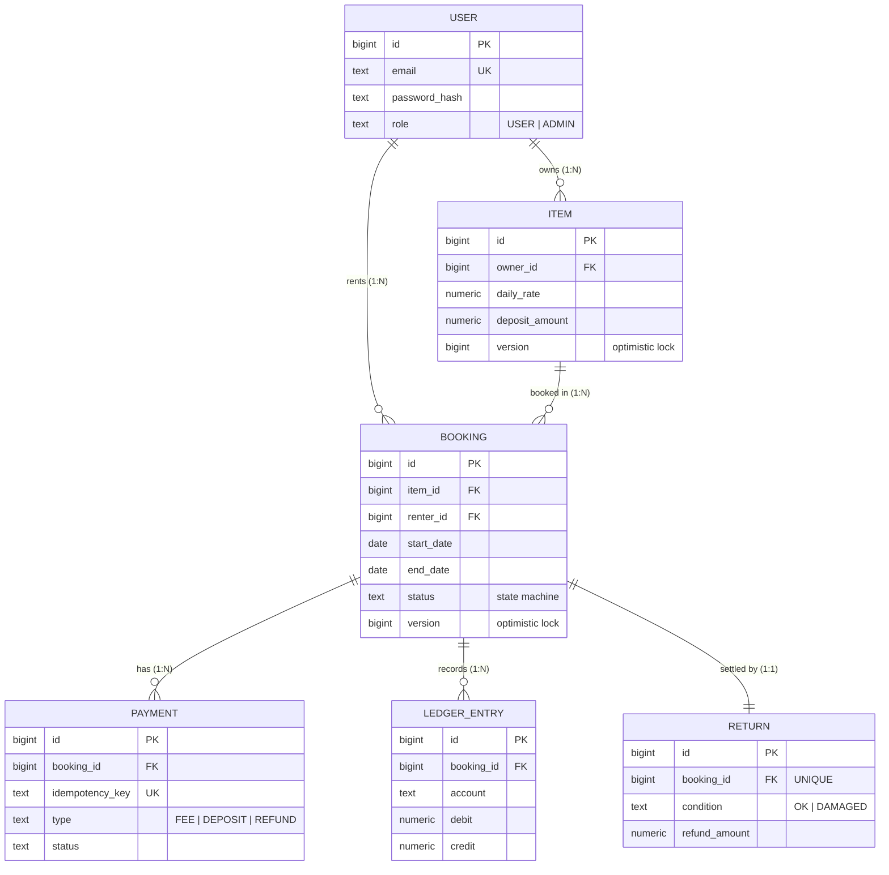
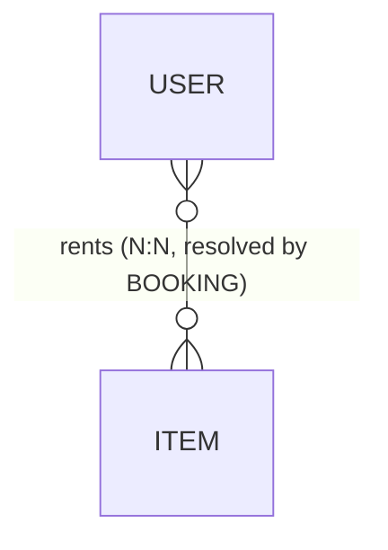
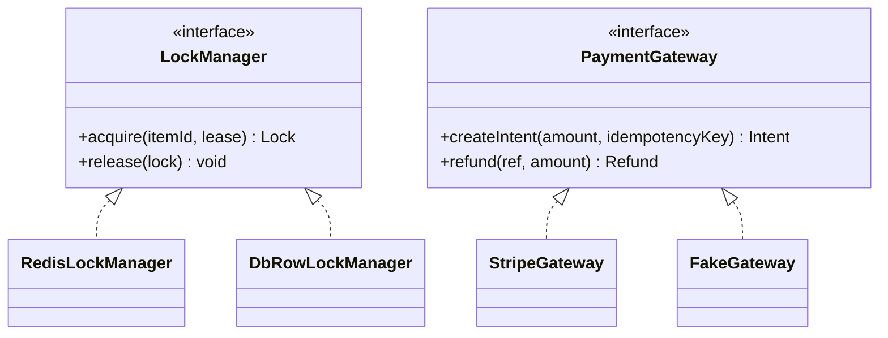
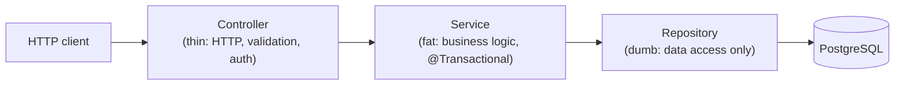
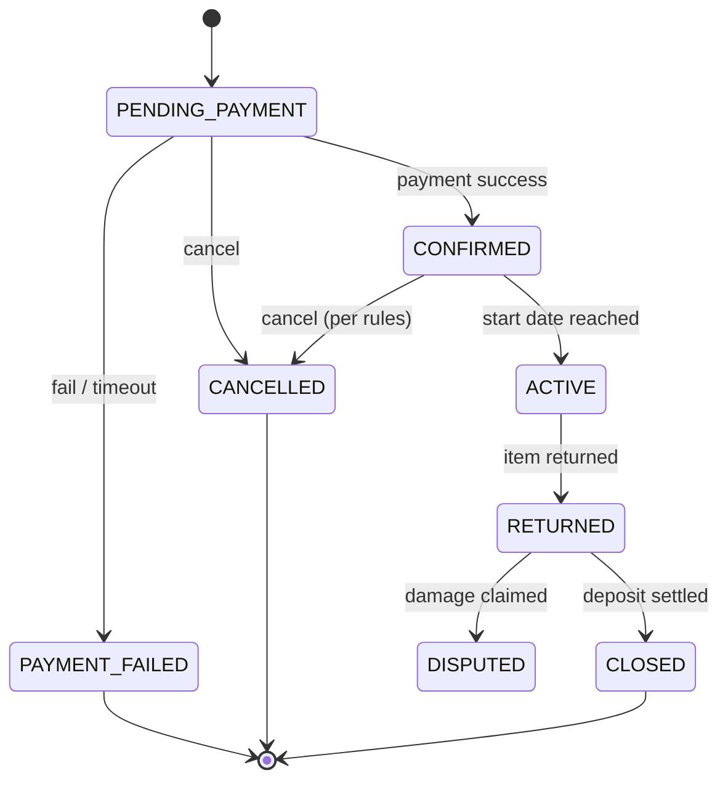
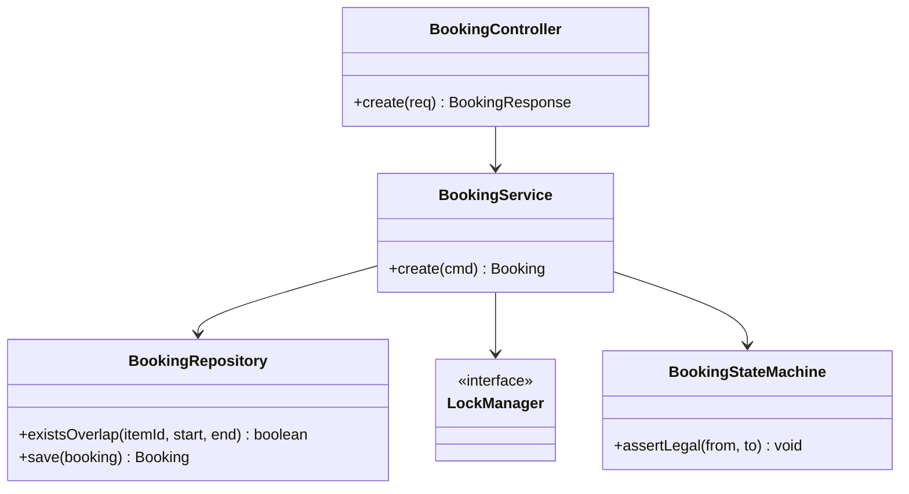

# RentFlow Backend — Low-Level Design (LLD)

The **initial LLD plan**: the models, the interfaces, how classes relate, and — most importantly —
**why** each choice was made. This is the "on the whiteboard" view. It's built to follow **SOLID**
and Spring-idiomatic layering so a reviewer sees deliberate design, not accidental structure.

> Sources: `README.md` (§5 data model, §9 LLD) and `BACKEND.md` (§2 structure, §5 LLD).

---

## 1. Design principles we commit to (and where each shows up)

| Principle (SOLID + friends) | What it means here | Where you see it |
|---|---|---|
| **S**ingle Responsibility | one class = one job | `JwtService` only mints tokens; `LedgerService` only posts entries |
| **O**pen/Closed | extend without editing | add a `NotificationChannel` (SMS) without touching the consumer |
| **L**iskov Substitution | any impl of an interface is swappable | `StripeGateway` ↔ a fake gateway in tests, no caller changes |
| **I**nterface Segregation | small, focused interfaces | `LockManager` exposes just `acquire`/`release`, nothing else |
| **D**ependency Inversion | depend on abstractions, not concretes | services depend on `PaymentGateway`, not `StripeGateway` |
| Package-by-feature | change a feature → touch one folder | `booking/`, `payment/`, `ledger/` … |
| Thin controller, fat service, dumb repository | logic sits in one testable layer | every feature follows `Controller → Service → Repository` |
| DTOs at the boundary | never leak JPA entities over HTTP | each feature's `dto/` package |

---

## 2. The domain model (entities & relationships)

### ER diagram — the shape of the data

### Reading the relationships (the cardinalities)
| Relationship | Type | Plain English | Why it's modelled this way |
|---|---|---|---|
| User → Item | **1 : N** | one user owns many items | ownership lives in `item.owner_id`, not in a role |
| User → Booking | **1 : N** | one user (as renter) makes many bookings | `booking.renter_id` points back to the user |
| Item → Booking | **1 : N** | one item is booked many times (over different dates) | history + the overlap check live on bookings |
| Booking → Payment | **1 : N** | one booking can have several payments | fee, deposit, and refund are separate `PAYMENT` rows |
| Booking → LedgerEntry | **1 : N** | one booking produces many ledger rows | double-entry: every movement is ≥2 balanced rows |
| Booking → Return | **1 : 1** | a booking is returned at most once | `return.booking_id` is UNIQUE |

### The hidden many-to-many (important interview point)
A **User** rents many **Items**, and an **Item** is rented by many **Users** — that's a
**many-to-many (N:N)** relationship. We do **not** model it with a join table of `user_item`.
Instead, **`Booking` is the associative entity** that resolves the N:N — and it carries extra data
(dates, status, amounts) that a plain join table couldn't.

> The lesson: when a many-to-many relationship needs its **own attributes** (here: dates, price,
> status), you promote the join into a first-class entity. `Booking` *is* that promoted join.
> If we later add tags, `Item }o--o{ Category` would be a "pure" N:N via an `item_category` join table.

---

## 3. The entities, one by one (what & why)

| Entity | Responsibility | Key design choice |
|---|---|---|
| **User** | account + auth identity | one role field (`USER`/`ADMIN`); owner vs renter are *capabilities*, not roles |
| **Item** | a rentable listing | `owner_id` FK enables **resource-level authz**; `@Version` for optimistic locking |
| **Booking** | the central entity | holds `status` (state machine), the date range, `@Version`; the concurrency battleground |
| **Payment** | one money attempt | `UNIQUE idempotency_key` — the DB-level guarantee that retries/duplicate webhooks are safe |
| **LedgerEntry** | one accounting row | double-entry; correctness is provable (`sum(debit) == sum(credit)`) |
| **Return** | the return event | `1:1` with Booking; drives deposit settlement |
| **processed_webhooks** | dedupe table | stores handled webhook IDs so a duplicate delivery is a no-op |

**Why entities over a document model:** money + bookings need ACID transactions, row locks, and
relational integrity (the ledger). A relational schema *is* the ledger; a document store would fight it.

---

## 4. The abstractions (interfaces) and why each exists

This is the heart of the SOLID story — **Dependency Inversion**. Services depend on interfaces, and
concrete implementations are injected. That makes each swappable and each fakeable in tests.

| Interface | Implementation(s) | Why it's an interface (the reason to say out loud) |
|---|---|---|
| `PaymentGateway` | `StripeGateway` (+ `RazorpayGateway` later, fake in tests) | swap payment providers without touching booking/payment logic |
| `LockManager` | `RedisLockManager` (+ `DbRowLockManager` alt) | the booking flow doesn't care *how* mutual exclusion is achieved |
| `EventPublisher` | `InMemoryPublisher` → `RabbitEventPublisher` | start simple in-process, upgrade to RabbitMQ; callers never change |
| `NotificationChannel` | `EmailChannel` (+ future SMS/push) | add channels without editing the consumer (**Open/Closed**) |
| `PricingStrategy` | `DailyPricing` (+ weekly/promotional) | pricing rules vary independently of booking logic (**Strategy pattern**) |

---

## 5. The layering rule (every feature obeys this)

- **Controller** — HTTP in/out, request validation, auth annotations. No business logic.
- **Service** — the logic, the transaction boundary, orchestration. Depends on interfaces.
- **Repository** — data access only, no logic. Spring Data JPA generates most of it.

Controllers never touch repositories; services never touch HTTP. This is the single most important
clean-code rule in the codebase.

---

## 6. The booking state machine (the LLD centrepiece)

Booking transitions live in **one** class (`BookingStateMachine`) with a legal-transition table, so
illegal jumps are rejected in one place — not scattered across services.

**Why a state machine:** it makes illegal states *unreachable*. Instead of scattering
`if (status == X)` checks everywhere, one table says which transitions are legal; everything else is
rejected centrally. This is the **State pattern** in practice.

---

## 7. How the booking-create flow uses these classes

**Flow (Day-8 target):** `create()` → acquire `LockManager` lock on `item:{id}` → `existsOverlap()`
→ if free, `SELECT … FOR UPDATE` + save `PENDING_PAYMENT` → release lock. The **exclusion
constraint** in Postgres is the final backstop even if the lock has a bug.

---

## 8. Shared / common building blocks (don't reinvent per feature)

| Component | Lives in | Job |
|---|---|---|
| `ApiError`, `Page<T>` | `common/dto/` | uniform response wrappers |
| `GlobalExceptionHandler` | `common/exception/` | one `@ControllerAdvice` → clean HTTP errors, no try/catch soup |
| `Auditable` base entity | `common/audit/` | `created_at` / `updated_at` on every table, defined once |
| money & date-range utils | `common/util/` | overlap math, currency handling in one place |
| `@Configuration` beans | `common/config/` | Redis, RabbitMQ, security wiring |

**Why:** cross-cutting concerns implemented once, reused everywhere — features don't re-solve the
same plumbing (DRY), and a reviewer finds each concern in exactly one place.

---

## 9. Design patterns used — and where

| Pattern | Where | Why |
|---|---|---|
| **State machine / State** | `BookingStateMachine` | reject illegal transitions in one place |
| **Strategy** | `PricingStrategy` | pricing rules vary independently |
| **Repository + Service** | every feature | Spring-idiomatic separation |
| **Dependency Inversion** | `PaymentGateway`, `LockManager`, `EventPublisher` | swappable + testable |
| **Idempotency key** | `Payment`, `WebhookController` | retries/duplicate webhooks are safe |
| **Optimistic + pessimistic locking** | `@Version` + `SELECT … FOR UPDATE` | correctness under concurrency |
| **Outbox** (optional, advanced) | `messaging/` | no dual-write bug between DB and queue |

---

## 10. Key decisions & rationale (the "why" summary)

| Decision | Chosen | Why (and when I'd choose differently) |
|---|---|---|
| Model layout | package-by-feature | change a feature → one folder; split to services only when a piece truly diverges |
| N:N User↔Item | resolved via `Booking` entity | the relation carries data (dates, status, price) → promote the join to an entity |
| Ownership | resource-level check (`owner_id == you`) | role says *what kind* of user; ownership says *whose* resource — you need both |
| Locking | Redis lock **+** DB row lock **+** exclusion constraint | three layers of defence; the DB constraint is the true guarantee |
| Money store | PostgreSQL | ACID + row locks + relational ledger; a document store would fight it |
| Gateway / lock / bus | behind interfaces | Dependency Inversion — swap impls, inject fakes in tests |
| Deposits/refunds | double-entry ledger | provable correctness: `sum(debit) == sum(credit)` |

---

## 11. The one-paragraph LLD script (say this in an interview)
> "Every feature is a vertical slice — entity, repository, service, controller, DTOs. Controllers are
> thin; services hold the logic and own the transaction; repositories only do data access. The two
> hard parts — locking and payments — sit behind interfaces, so they're swappable and I can inject
> fakes in tests. Booking transitions are governed by an explicit state machine, so illegal states
> are unreachable. The User-to-Item many-to-many is resolved by the Booking entity because the
> relationship carries its own data. And the ledger only writes balanced pairs, so the books always
> balance."
